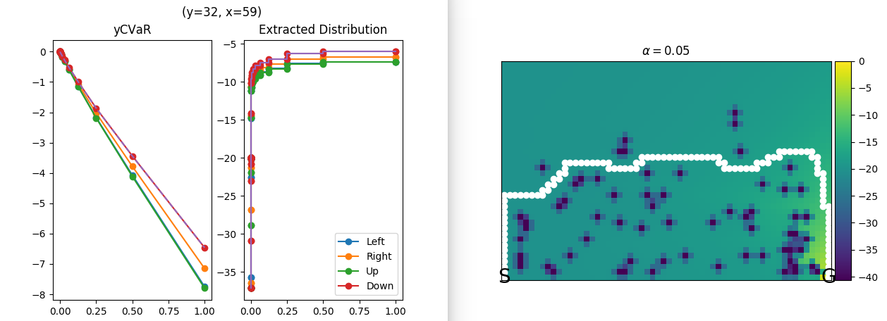

# Gridworld

This subpackage contains a risk-sensitive gridworld environment (`cliffwalker.py`) and algorithms that solve it.

Tweak the file `core/constants` if you want to test with different atoms. Note that Q-learning (empirically) prefers uniform atoms while VI performs better with log-spaced atoms.

----------------------------------------------------------------------

For CVaR Value Iteration run

    python3 run_vi.py

If the shown deterministic path stops before target, increase the number of atoms around the critical point.

----------------------------------------------------------------------

For CVaR Q-learning run
    
    python3 run_q.py

----------------------------------------------------------------------

You can also check how standard RL behaves on the gridworld by running

    python3 exp_model.py

See the main function for different algorithms. 

----------------------------------------------------------------------

Both CVaR VI and Q-learning have interactive plots - click somewhere on the learned grid and a distribution plot will pop out.

 
